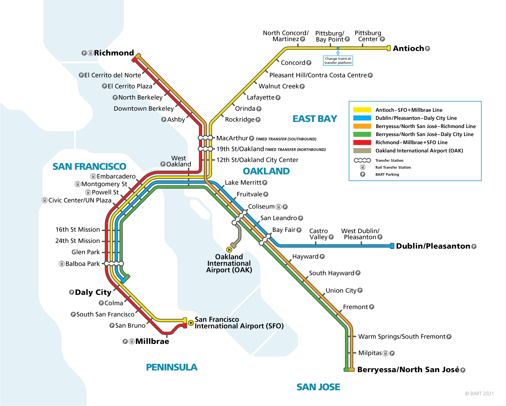

# ucb_mids_w205_project_3
Fundamentals of Data Engineering

## By Sophie Yeh, Melissa McGee, and Krutika Ingale

## New Skills
* Creating a NoSQL graph database in Neo4j
* Functional programming using Python and Cypher
* Writing Python code to pull data using SQL and insert nodes and relationships into Neo4j using Cypher
* Compare and contrast graphs stored in SQL with NoSQL
* Writing Python code to run graph algorithms and wrangle the results
* Using geodesic distances
* Understanding how the NoSQL document database MongoDB can be useful
* Understanding how the NoSQL in-memory key-value store database Redis can be useful

## BART Map

## Business Case Scenario

Assume you are a full stack data scientist at Acme Gourmet Meals (AGM).

AGM executives have heard of some new futuristic delivery and pickup options that they want to investigate at a preliminary level:
* Adding more pickup locations
* Using public transportation to transport deliveries
* Using delivery drones
* Using delivery robots
* A hybrid approach of any combination of these options

**Berkeley store, San Francisco Bay Area, BART**

For this investigation, the executives only want you to expore the Berkeley store, the San Francisco Bay Area, and BART.

**Adding more pickup locations**

Adding more pickup locations is generally considered an easy way to grow the customer base and grow the frequency that customers purchase meals.

Creating a pickup location requires renting (or purchasing) property, renovating (or building) space in a way suitable for the business.

Since the executives would be considering longer term leases (or purchases) with expensive renovation (or building), they want to see if they can future proof their location choices.

Locations at or near BART stations would be good choices because BART riders could easily pick up meals at the stations they travel through on the way to or from work.  Most would probably pick them up on the way home, but if they have refrigerators at work, some may pick them up on the way to work.

**Using public transportation to transport deliveries**

Using public transportation to transport deliveries has been used in some areas for a long time, such as the Dabbawalas in Mumbai, India, which started in the late 1800's.

In the US, informal use of public transportation has been used for messenger and delivery services in some of the larger cities.

Most large cities are starting to explore allowing organized, wide spread use of public transportation for deliveries.  Some proposals even allow for special train cars, or even special trains, strictly for delivery.

The executives want to future proof their decision on adding pickup locations to be able to take advantage of using BART to transport deliveries in the future.

**Using delivery drones**

The executives want to future proof their decision on adding pickup locations to be able to take advantage of adding delivery drones in the future.

**Using delivery robots**

The executives want to future proof their decision on adding pickup locations to be able to take advantage of adding delivery robots in the future.

**Hybrid approach**

The executives want to explore some hybrid approaches that might be possible, such as:
* Using BART to transport deliveries to various pickup locations near BART stations where customers can pickup their meals
* Using BART to transport deliveries to traditional manned delivery trucks 
* Using BART to transport deliveries to delivery drones 
* Using BART to transport deliveries to delivery robots 

**Using NoSQL databases**

So far the IT department only has SQL based traditional relational databases.  Your data science manager has discussed with the executives bringing in NoSQL databases in the cases where it makes more sense than a SQL based relational database.

The IT department has created a traditional relational data model, in Third Normal Form, 3NF, for the BART system:
* **stations** table with each station name, latitude-longitude, and average transfer time in seconds
* **lines** table with each line by color, with the sequence of stations going one way (trains move both ways, but in keeping with 3NF, they only store it one way)
* **travel_times** table with station_1, station_2, and the average travel time in seconds between then.  station_1 is alphabetically less than station_2 (trains move both ways, but in keeping with 3NF, they only store it one way).  All lines between the same two stations have the same average travel time.

The IT department has provided us with CSV files of these tables.

A NoSQL graph database such as Neo4j would be a logical choice to analyze a system such as BART.  The executives would like to hear about the differences between using a traditional SQL relational database to store graphs and using Neo4j.

The executives would also like some suggestions on how a NoSQL document store such as MongoDB and/or a NoSQL in-memory key-value store such as Redis might be used in future systems related to the hybrid deliveries.

## Coding Part

In part 3.1: create and load the stations, lines, and travel_times tables for the BART system that we received from the IT department.

In part 3.2: create some queries on the stations, lines, and travel_times tables for the BART system that we will use later to create the graph.

In part 3.3: create a graph database in Neo4j for the BART system from the queries in part 3.2.  This graph will allow you to do further analysis on the BART system, paths, centrality, etc.

In part 3.4: verify the graph database in Neo4j for the BART system.  You will run some shortest paths and verify that they are correct to help verify that you have created the graph correctly.

In part 3.5: use geodesic distances and zip code and population data to enhance our BART model.  For a station, you can find all the zip codes within X miles, the population of each zip code, and the total population.  This will allow you to analyze how much population is within a BART station area, how much population a delivery drone could service, how much population a delivery robot could service, etc.
